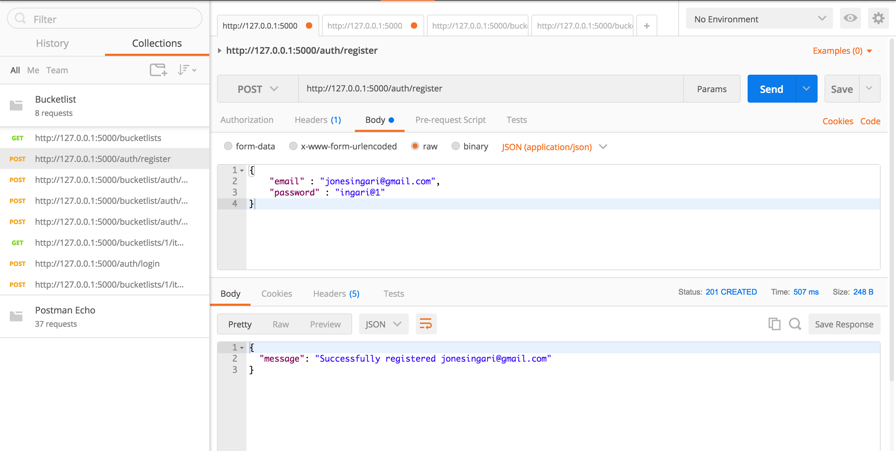
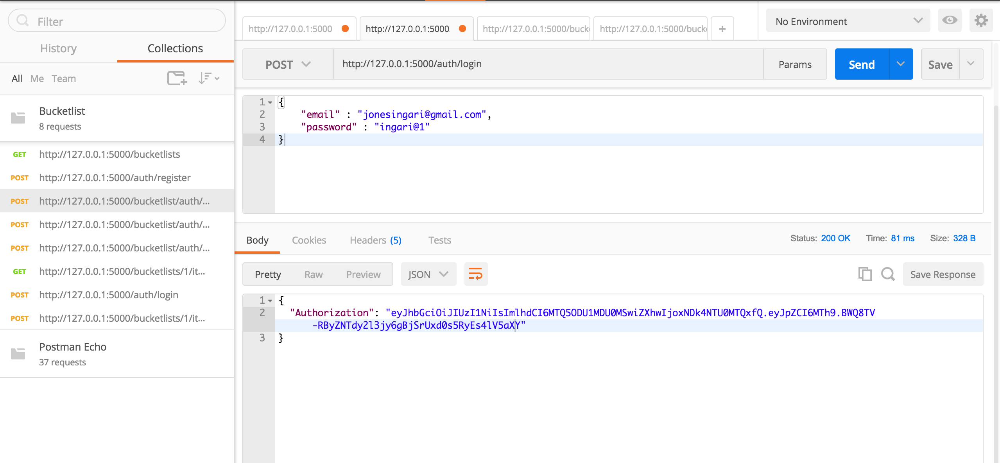
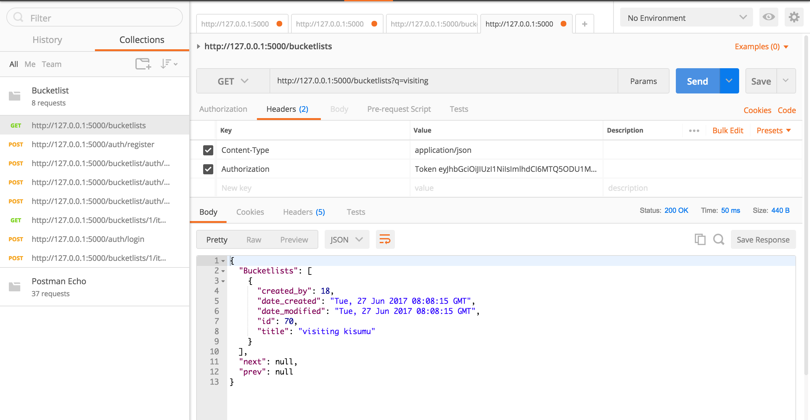
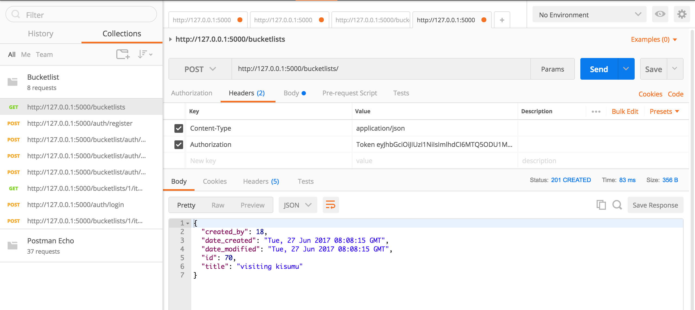

# Bucketlist API
## Introduction

According to Merriam-Webster Dictionary, a Bucket List is a list of things that one has not done before but wants to do before dying.
This is an API for an online Bucket List service using Flask.

## Requirements

The building blocks used are:
  1. python version 3.6
  2. Flask
  3. PostgresSQL

## Installation

 The following set of steps are necessary to facilitate running the application locally:

   - clone the following repo
        `https://github.com/Awinja-Andela/Bucketlist-Server.git`
        
   - cd into `Bucketlist-Server` and create a VirtualEnvironment using the following command:
        `virtualenv <name_of_env>`
   - To activate the virtualenv, cd into the `<name_of_env>/bin/` and use the following command:
        `source activate`
   - To install all app requirements
        `pip install -r requirements.txt`
   - Create the database and run migrations
   
        `$ python manage.py db init`

        `$ python manage.py db migrate`

        `$ python manage.py db upgrade`

 __You are now set!__
 you can now run the server using `python manage.py runserver` command
 
 ### Interact with the API, send http requests using Postman
 
 
 ## API Endpoints
 
| URL Endpoint | HTTP Methods | Summary |
| -------- | ------------- | --------- |
| `/auth/register` | `POST`  | Register a new user|
| `/auth/login` | `POST` | Login and retrieve token|
| `/bucketlists` | `POST` | Create a new Bucketlist |
| `/bucketlists` | `GET` | Retrieve all bucketlists for user |
| `/bucketlists/?page=1&limit=20` | `GET` | Retrieve three bucketlists per page |
| `/bucketlists/?q=name` | `GET` | searches a bucketlist by the name|
| `/bucketlists/<id>` | `GET` |  Retrieve a bucketlist by ID|
| `/bucketlists/<id>` | `PUT` | Update a bucketlist |
| `/bucketlists/<id>` | `DELETE` | Delete a bucketlist |
| `/bucketlists/<id>/items` | `POST` |  Create items in a bucketlist |
| `/bucketlists/<id>/items/<item_id>` | `DELETE`| Delete an item in a bucketlist|
| `/bucketlists/<id>/items/<item_id>` | `PUT`| update a bucketlist item details|

### Sample Requests

User Registration

User login

Adding a Bucketlist

Searching

# Testing

You can run the tests using this command `nosetests --with-coverage`

